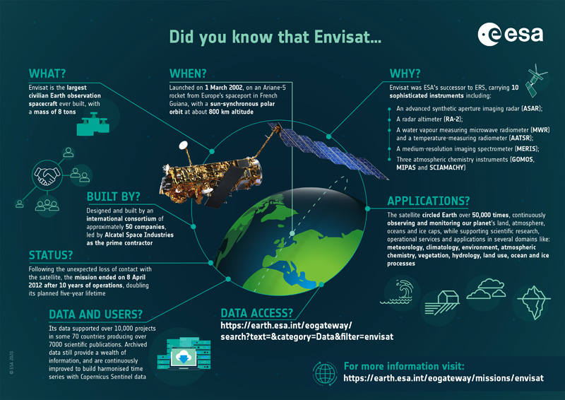
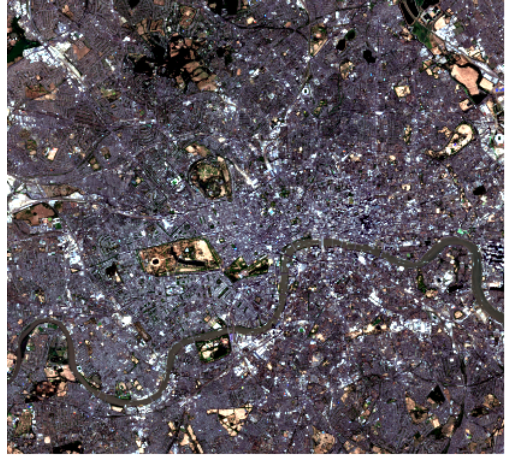
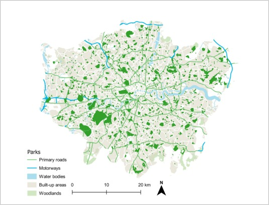

## 1. Summary

This week, we kicked things off with the fundamental concepts of Remote Sensing (RS) and how satellite imagery can actually help us "see" cities differently. At its core, RS is about grabbing data from the Earth’s surface without being physically there—using sensors on satellites or planes. The whole thing works because different objects (like concrete vs. grass) have their own "spectral signatures"; they absorb and reflect electromagnetic radiation in unique ways (Jensen, 2015).

In the lab, I spent some time looking at **Sentinel-2** (from ESA) and **Landsat** data. While Landsat is great for long-term historical trends (Tempfli et al., 2009), Sentinel-2 is a bit of a game-changer for urban studies because of its 10m resolution.

{#fig-sensors fig-align="center" width="80%"}

I chose **London** as my test case. It’s a messy, complex urban landscape that really tests how well these sensors work. I processed two different views of the city using Sentinel-2 L2A data:

::: {layout-ncol="2"}
{#fig-true}

{#fig-false}
:::

Comparing @fig-true and @fig-false, it’s obvious why we don't just stick to "true" colors. In the False Colour image, spots like **Hyde Park** and **Richmond Park** scream at you in red, making it much easier to quantify green space than in the muddy greens of the first image.

------------------------------------------------------------------------

## 2. Applications

Remote sensing isn't just about making cool maps; it’s a heavy-lifter in urban planning and environmental policy. For instance, being able to track urban sprawl or Land Use / Land Cover (LULC) changes over decades is huge. Jensen (2015) highlights how time-series data from Landsat allows us to see exactly how cities "eat" into the surrounding ecosystem.

What I found interesting is its role in the **UN Sustainable Development Goals (SDGs)**. Agencies are increasingly leaning on Earth Observation (EO) to monitor things like forest loss or urban sustainability (Butcher, 2016). It provides a level of "ground truth" that is hard to fake or ignore.

In a local context, Sentinel-2’s high resolution is perfect for the "Urban Heat Island" effect. By using the NIR band to calculate indices like **NDVI**, we can map out exactly where a city is lacking cooling vegetation. It’s gone from being a niche scientific tool to a genuine piece of evidence for city governance.

{#fig-ndvi fig-align="center" width="80%"}

------------------------------------------------------------------------

## 3. Reflection

Coming from an architecture background, I’m used to looking at cities through site plans and CAD files, which are very "static." RS feels different—it’s dynamic and continuous. It’s quite powerful to realize that a single image can tell you so much about the health of a city's parks or the density of its concrete.

However, the practical side is a bit of a steep learning curve. Even just picking the right image without too much cloud cover or figuring out which correction level to use (like L2A vs L1C) took more "trial and error" than I expected. Moving forward, I really want to get better at the actual processing side—not just looking at the images, but digging into the pixel values to do some proper quantitative analysis.

------------------------------------------------------------------------

## References

-   Butcher, G. (2016) *The Role of Remote Sensing in Monitoring the SDGs*.

-   Jensen, J. R. (2015) *Introductory Digital Image Processing: A Remote Sensing Perspective*. 4th edn. Pearson.

-   Tempfli, K. et al. (2009) *Principles of Remote Sensing*. ITC.
