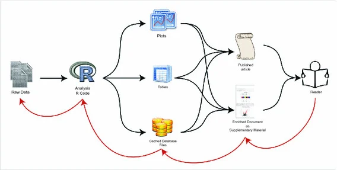

|                                                       |
|-------------------------------------------------------|
| title: "Week 2: Sentinel-2 and Reproducible Research" |
| author: "Sheng Li"                                    |

## Slide Deck Access and Interaction

1.  **Host platform**: The full interactive presentation is hosted on GitHub Pages for easier access and navigation.
2.  **On-page viewing**: The embedded frame below allows the slides to be viewed directly on the page.
3.  **Full-screen mode**: The link in the note below opens the presentation in a separate browser tab.

::: callout-note
## Slide Deck Access

Below is my embedded slide deck on the **Sentinel-2** program. You can view the slides here or [click here for the full-screen version](week2xa.html).
:::


```{=html}
<style>
  .slide-wrapper {
    position: relative;
    width: 100%;
    border-radius: 10px;
    overflow: hidden;
    box-shadow: 0 4px 20px rgba(0,0,0,0.15);
    background: #000;
  }
  .slide-iframe {
    display: block;
    width: 100%;
    aspect-ratio: 16 / 9;
    border: none;
  }
  .slide-controls {
    display: flex;
    align-items: center;
    justify-content: center;
    gap: 12px;
    padding: 10px 0 20px 0; /* 增加底部间距 */
  }
  .slide-btn {
    background: #1e1b2e;
    color: #e2d9f3;
    border: 1px solid #3d3558;
    border-radius: 8px;
    padding: 7px 20px;
    font-size: 0.85rem;
    cursor: pointer;
    transition: all 0.15s ease;
    font-family: inherit;
  }
  .slide-btn:hover {
    background: #2d1f3d;
    border-color: #c084fc;
    color: #c084fc;
  }
  .slide-btn-full {
    margin-left: auto;
    padding: 7px 14px;
    font-size: 0.8rem;
  }
</style>
```

::: slide-wrapper
<iframe id="xaringan-iframe" class="slide-iframe" src="week2xa.html" allowfullscreen>

</iframe>
:::

```{=html}
<style>
.slide-controls {
  display: flex;             /* 使用弹性布局 */
  justify-content: center;    /* 水平居中 */
  align-items: center;        /* 垂直居中对齐，解决“歪了”的问题 */
  gap: 10px;                  /* 按钮之间的间距 */
  margin-top: 20px;
}

.slide-btn {
  height: 38px;               /* 统一高度 */
  padding: 0 15px;            /* 统一左右内边距 */
  display: flex;
  align-items: center;        /* 按钮内部文字垂直居中 */
  justify-content: center;
  border-radius: 5px;
  border: 1px solid #2e2e3e;
  background-color: #1e1e2e;
  color: white;
  cursor: pointer;
  font-size: 14px;
}

.slide-btn:hover {
  background-color: #2e2e3e;
}
</style>
```

::: slide-controls
<button class="slide-btn" onclick="slideNav(&#39;prev&#39;)">

← Prev

</button>

<button class="slide-btn" onclick="slideNav(&#39;next&#39;)">

Next →

</button>

<button class="slide-btn slide-btn-full" onclick="goFullscreen()">

⛶ Fullscreen

</button>
:::

:::

```{=html}
<script>
  function slideNav(dir) {
    var iframe = document.getElementById('xaringan-iframe');
    var key = dir === 'next' ? 'ArrowRight' : 'ArrowLeft';
    var keyCode = dir === 'next' ? 39 : 37;
    try {
      iframe.contentWindow.focus();
      iframe.contentDocument.dispatchEvent(
        new KeyboardEvent('keydown', {
          key: key,
          keyCode: keyCode,
          which: keyCode,
          bubbles: true,
          cancelable: true
        })
      );
    } catch(e) {
      console.warn('Navigation blocked: Use the fullscreen mode if the iframe is cross-origin.', e);
    }
  }

  function goFullscreen() {
    var iframe = document.getElementById('xaringan-iframe');
    if (iframe.requestFullscreen) { iframe.requestFullscreen(); } 
    else if (iframe.webkitRequestFullscreen) { iframe.webkitRequestFullscreen(); }
  }
</script>
```

## Summary

This week focused on learning how to create reproducible presentations using Xaringan and how to organise coursework within a Quarto portfolio hosted on GitHub. Unlike traditional presentation software such as PowerPoint, Xaringan allows slides to be created using R Markdown syntax. In practice this means that presentations can combine text, code and visual outputs within the same document. As a result, slides can be generated directly from data analysis workflows, which makes the process more transparent and reproducible.

For the presentation task I chose to focus on the Sentinel-2 satellite sensor, which forms part of the Copernicus Earth observation programme developed by the European Space Agency (ESA). Sentinel-2 actually consists of two satellites, Sentinel-2A and Sentinel-2B, launched in 2015 and 2017 respectively. Working together, they provide global coverage approximately every five days. This relatively high temporal resolution makes the dataset particularly suitable for monitoring environmental change and urban development over time.

{#fig-sentinel-bands}

One of the key components of Sentinel-2 is the Multispectral Instrument (MSI). This sensor records information across 13 spectral bands that span different parts of the electromagnetic spectrum. Because each band captures different wavelengths of reflected radiation, the sensor can reveal surface characteristics that are not always visible in standard optical imagery. For instance, vegetation reflects strongly in the near-infrared portion of the spectrum, which makes this band particularly useful for identifying plant cover.

In the presentation I also discussed how different band combinations can be used to produce different visual representations of satellite imagery. A true colour composite typically uses the visible red, green and blue bands (B04, B03 and B02). The resulting image looks relatively similar to what a person might see from an aircraft or aerial photograph. While this representation is intuitive to interpret, it does not always emphasise environmental patterns very clearly.

A false colour composite, by contrast, replaces one of the visible bands with near-infrared information. A common combination is B08, B04 and B03. In this configuration vegetation appears bright red because of its strong reflectance in the near-infrared band. This makes vegetation distribution much easier to detect and analyse, particularly in urban landscapes where green spaces may otherwise be difficult to distinguish.

Overall, the Sentinel-2 sensor provides high-resolution multispectral imagery that supports a wide range of applications, including environmental monitoring, agricultural assessment and urban analysis.

{#fig-workflow}

# Reflection

This week’s session felt quite different from the previous one, mainly because the focus shifted from analysing remote sensing data to thinking about how research outputs can be organised and communicated. At first, using Xaringan to build slides felt slightly unfamiliar, as I am more accustomed to working with conventional presentation software. However, after spending some time working with Markdown syntax, the workflow began to make more sense. It became apparent that this approach allows presentations to be structured in a much more systematic way.

One aspect that stood out was the integration between Xaringan, Quarto and GitHub. Instead of producing separate files for slides, reports and figures, it becomes possible to manage everything within a single reproducible project structure. Figures generated during analysis can be inserted directly into slides or written reports, which helps ensure that the outputs remain consistent with the underlying data processing workflow.

More broadly, this workflow appears to reflect how many contemporary data-driven research projects are organised. Remote sensing studies often involve large datasets, multiple processing steps and frequent revisions. Tools such as Quarto and GitHub provide a way to document these steps while also tracking changes over time. This kind of reproducible workflow may therefore be particularly useful for spatial data analysis, where transparency and repeatability are increasingly important.

Although I am still becoming familiar with these tools, learning how to integrate analysis, documentation and presentation within a single workflow seems likely to be valuable for future projects involving geospatial data.

# References

Copernicus Programme (2023) Sentinel-2 Mission Documentation. Available at: https://www.copernicus.eu

European Space Agency (ESA) (2023) Sentinel-2 Mission Overview. Available at: https://www.esa.int

Jensen, J.R. (2015) Introductory Digital Image Processing: A Remote Sensing Perspective. 4th edn. Upper Saddle River: Pearson.
