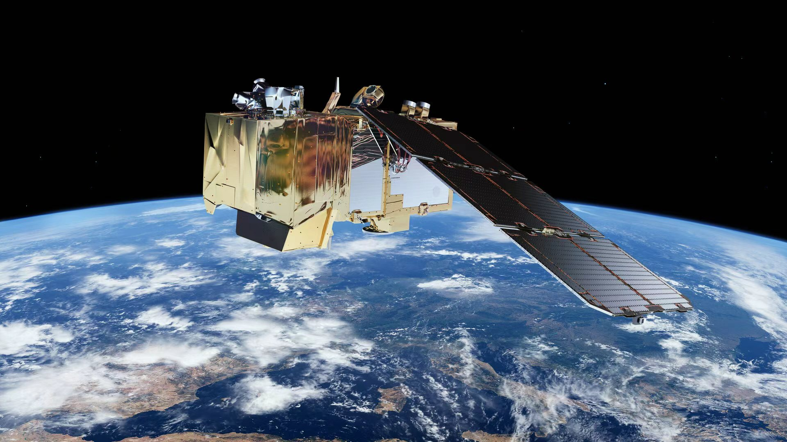
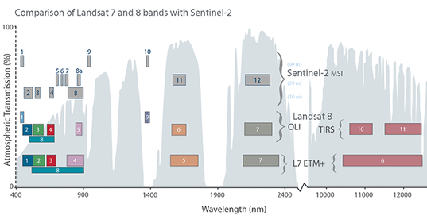
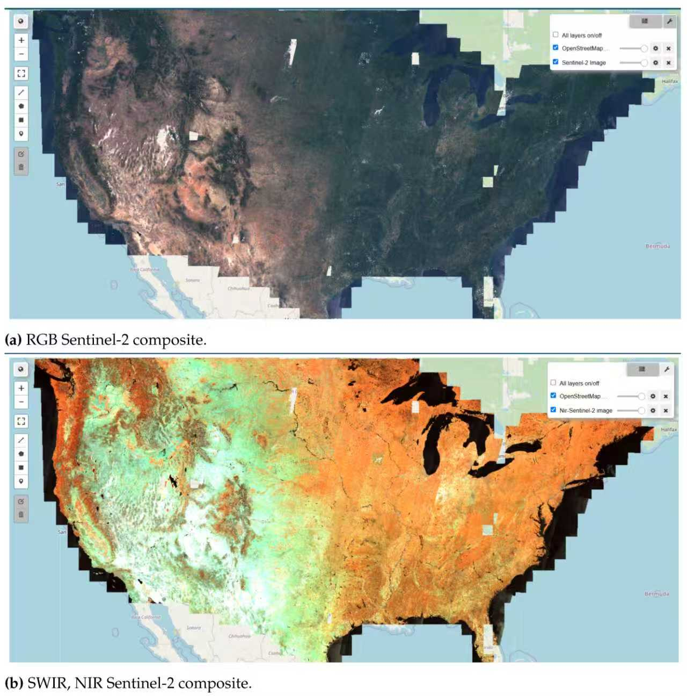

# 1. Introduction

Sentinel-2 is an Earth observation satellite mission developed by the **European Space Agency (ESA)** as part of the **Copernicus programme**.

.center[

 
.small-text[*Sentinel-2 satellites provide multispectral imagery for Earth observation.*]
]

---

# 1.1 Objectives & Constellation

### Main Objectives:
* **Monitor** land cover change 
* **Support** environmental monitoring 
* **Provide** data for agriculture and urban analysis 

### Constellation:
* **Sentinel-2A** (launched in 2015) 
* **Sentinel-2B** (launched in 2017)
* Together they provide **global coverage every 5 days**.

---

# 2. Sensor Characteristics

Sentinel-2 carries a **Multispectral Instrument (MSI)**.

### Key Technical Specs:
* **13 spectral bands** (from VNIR to SWIR)
* **Spatial Resolution:**
  * **10 m**: Visible (B2, B3, B4) and NIR (B8)
  * **20 m**: Red-edge and Shortwave Infrared (SWIR)
  * **60 m**: Atmospheric bands (Coastal aerosol, Water vapour, Cirrus)

This high spatial resolution allows detailed monitoring of land surfaces.

---

# 3. Spectral Bands

Different surfaces reflect electromagnetic radiation differently across the spectrum.

.center[

 
.small-text[*The Sentinel-2 MSI sensor captures 13 spectral bands across visible, near-infrared and shortwave infrared wavelengths.*]
]

---

# 3.1 Detailed Spectral Bands

| Band | Description | Wavelength (nm) | Resolution | Application |
|:---:|:---|:---:|:---:|:---|
| **B2** | Blue | 490 | 10m | Water & Atmosphere |
| **B3** | Green | 560 | 10m | Vegetation reflectance |
| **B4** | Red | 665 | 10m | Land cover detection |
| **B8** | NIR | 842 | 10m | **Vegetation health** |
| **B11**| SWIR 1 | 1610 | 20m | Snow/Ice/Cloud discrimination |
| **B12**| SWIR 2 | 2190 | 20m | Vegetation moisture |

These bands allow researchers to analyse environmental features that cannot be seen in normal photographs.

---

# 4. True Colour Composite (TCC)

True colour imagery simulates human vision by using the visible spectrum:

* **Red:** Band 4 (B04)
* **Green:** Band 3 (B03)
* **Blue:** Band 2 (B02)

### Typical Applications:
* **Urban mapping**: Identifying buildings, roads, and infrastructure.
* **Land cover interpretation**: Distinguishing between forest, water, and soil.
* **Visual analysis**: General landscape surveys.

---

# 5. False Colour Composite (FCC)

Standard False Colour (NIR-Red-Green) is widely used for ecology:

.center[

 
.small-text[*False colour composites highlight vegetation using near-infrared reflectance.*]
]

* **NIR:** Band 8 (B08) -> Rendered as **Red**
* **Red:** Band 4 (B04) -> Rendered as **Green**
* **Green:** Band 3 (B03) -> Rendered as **Blue**

---

# 5.1 Why Use False Colour?

### Why use it?
* **Vegetation** appears **bright red** due to high NIR reflectance (mesophyll structure).
* **Water** appears dark or black because it absorbs most NIR radiation.
* **Soil** appears in shades of brown or cyan depending on moisture and composition.

### Key Benefits:
* **Plant Health**: Reveals subtle variations in vegetation vigor.
* **Delineation**: Differentiates vegetation types and water bodies much more clearly than TCC.
* **Land Use**: Useful for identifying agricultural patterns and forest density.

---

# 6. Environmental Applications

Sentinel-2's high revisit frequency makes it ideal for dynamic monitoring:

### Ecosystems & Hydrology:
* **Forestry**: Deforestation tracking and fire scar mapping.
* **Agriculture**: Crop yield prediction and precision farming.
* **Water Quality**: Monitoring chlorophyll-a and turbidity in inland waters.
* **Disasters**: Flood mapping and glacial retreat monitoring.

The open access nature of the data has made Sentinel-2 widely used in global research.

---

# 7. Urban Applications

Sentinel-2 is a game-changer for **Urban Remote Sensing**:

* **Urban Expansion**: Tracking the conversion of rural land to built-up areas.
* **Green Spaces**: Identifying "Green Lungs" within cities for planning.
* **Heat Island Effects**: Provides NDVI data needed to model the **Urban Heat Island (UHI)** effect.

Satellite imagery provides valuable spatial information for understanding cities.

---

# 8. Advantages and Limitations

### Advantages 👍
* **High Resolution**: 10m is superior to Landsat-8's 30m.
* **Revisit Time**: 5-day cycle is perfect for time-series.
* **Open Access**: Free for everyone via Copernicus Open Access Hub.

### Limitations 👎
* **Cloud Cover**: Optical sensors cannot see through **clouds**.
* **No Thermal Band**: Cannot directly measure surface temperature.

---

# 9. Conclusion

Sentinel-2 provides **high-resolution multispectral imagery** that is widely used in remote sensing.

It plays an important role in:

- Environmental monitoring
- Urban analysis
- Sustainable development research

Satellite imagery provides valuable insights for understanding and managing the Earth's surface.

---

# References

* European Space Agency (ESA). *Sentinel-2 Mission Overview*.
* Jensen, J. R. (2015). *Introductory Digital Image Processing.*
* Copernicus Programme Documentation.