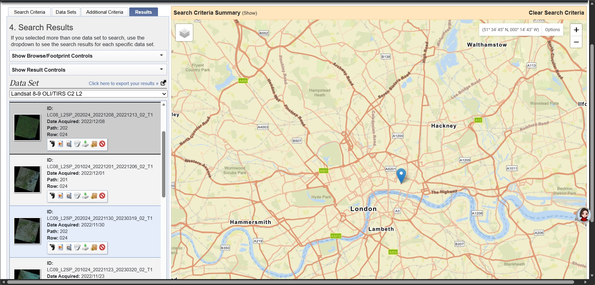
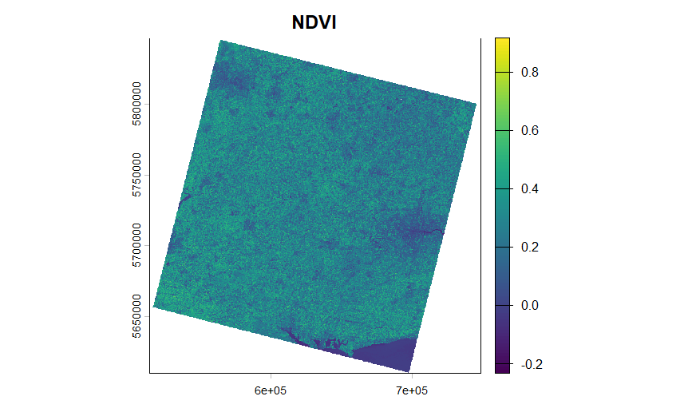
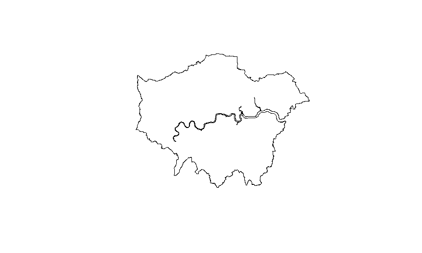
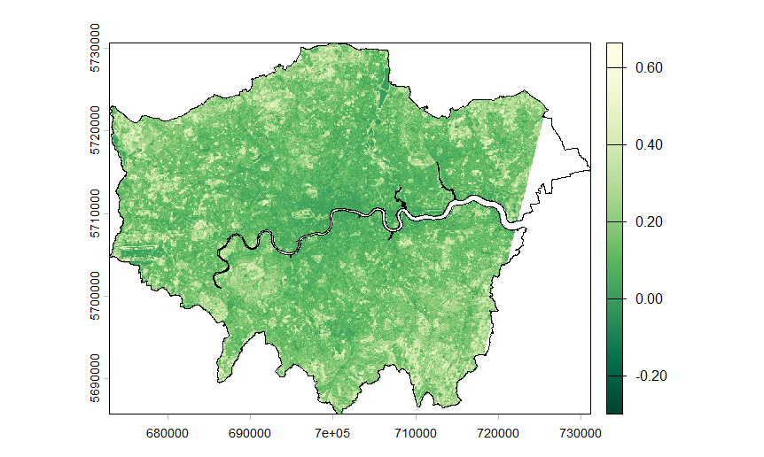
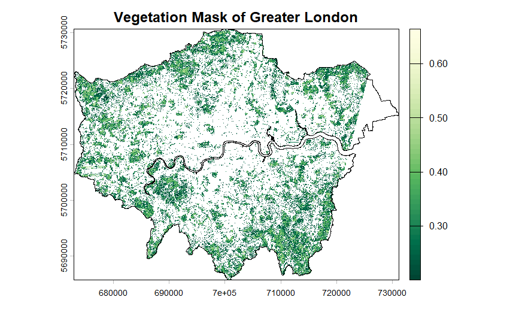
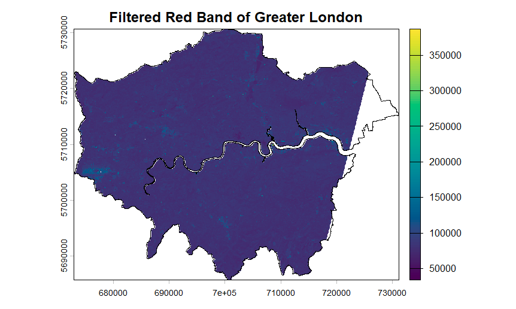
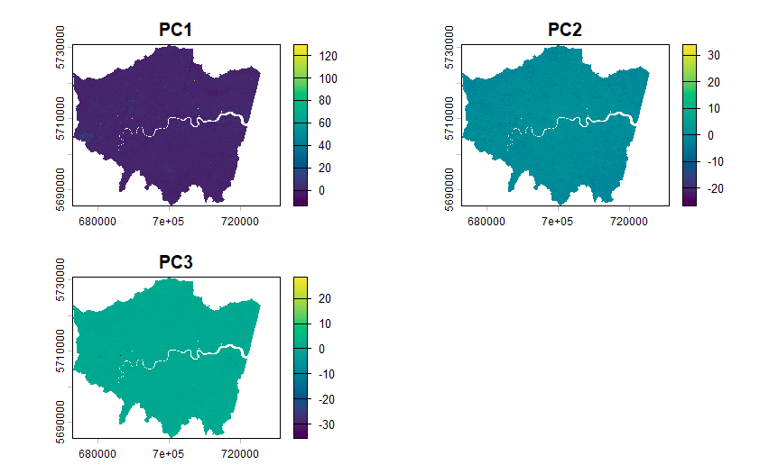

## Summary

This week’s learning focused on the pre-processing and enhancement of remote sensing data, including atmospheric correction, image mosaicking, and image enhancement techniques such as **NDVI**, **filtering**, and **Principal Component Analysis (PCA)**. Through the practical exercises, I gradually developed an understanding of how satellite imagery is transformed from raw Digital Number (DN) values into analytically useful reflectance data, as well as how different processing steps influence the final results.

{#fig-1 width="80%"}

In the practical work, I used **Landsat 8 Level-2** data and selected London as the study area. Compared to previous work where I analysed the full satellite image, this week I learned how to clip the imagery using administrative boundary data, making the results more geographically meaningful.This process highlighted the importance of data pre-processing in remote sensing analysis.

------------------------------------------------------------------------

## Applications

In the practical section, I first completed the loading and processing of Landsat data, and then calculated the **Normalized Difference Vegetation Index (NDVI)**. NDVI reflects vegetation health by measuring the difference between the near-infrared (NIR) and red bands:

$$NDVI = \frac{NIR - Red}{NIR + Red}$$

The results show that NDVI values are higher in the peripheral areas of London, while lower values are observed in the central urban areas. The River Thames is clearly identifiable as a low-value feature, which is consistent with the actual urban structure.

{#fig-2 width="80%"}

In my initial attempt, I analysed the full Landsat image, which resulted in a tilted rectangular scene that I found confusing at first. Through further learning, I realised that this is because Landsat data are acquired based on orbital path/row rather than administrative boundaries. To address this, I downloaded official administrative boundary data for London (London Boroughs) and used the crop() and mask() functions to clip the imagery. After completing this step, the NDVI map accurately represented the spatial form of London, significantly improving the readability of the results.

{#fig-3 width="80%"}

Subsequently, I applied a threshold to the NDVI values (NDVI ≥ 0.2) to generate a **vegetation mask**, which allowed me to distinguish green spaces from built-up areas within the city. This step helped me to better understand the fundamental logic of remote sensing classification, where simple rules can be used to extract specific land cover types.

::: {layout-ncol="2"}
{#fig-4}

{#fig-5}
:::

In addition, I applied a focal filter to the red band to enhance the spatial characteristics of the image. Although the result is less visually intuitive than NDVI, this process helped me understand the role of image enhancement in highlighting spatial patterns and structures.

Finally, I conducted **Principal Component Analysis (PCA)** to reduce the dimensionality of the multispectral data into a smaller number of components. The results show that PC1 mainly represents overall brightness, while PC2 and PC3 highlight spectral differences between different land cover types. This method reduces data redundancy while preserving key information, providing an important foundation for further analysis.

::: {layout-ncol="2"}
{#fig-6}

{#fig-7}
:::

------------------------------------------------------------------------

## Reflection

This week’s learning made me realise that remote sensing analysis is not simply about interpreting images, but rather a complete workflow involving data processing, transformation, and interpretation. Compared to previous tasks that focused more on visualisation, this week placed greater emphasis on data processing and methodological understanding, which I found quite challenging.

During the practical work, the main difficulty I encountered was my unfamiliarity with the data processing workflow. For example, I initially used inappropriate data sources for clipping the imagery and struggled to correctly extract the London boundary. These issues were initially confusing, but through experimenting with different datasets (such as GADM, OSM, and eventually the London Borough dataset), I gradually learned how to select suitable data sources and perform spatial clipping effectively. Although this process was time-consuming, it significantly improved my understanding of GIS data structures.

------------------------------------------------------------------------

## References

-   **Butcher, G. (2016)** *The Role of Remote Sensing in Monitoring the SDGs*. Available at: https://www.un.org/

-   **Jensen, J.R. (2015)** *Introductory Digital Image Processing*. 4th edn. Pearson.

-   **Schulte to Bühne, H. and Pettorelli, N. (2018)** ‘Better together: Integrating and fusing multispectral and radar satellite imagery’, *Methods in Ecology and Evolution*, 9(4).

-   **USGS (2020)** *Landsat 8 Collection 2 Level-2 Science Product Guide*.

-   **Greater London Authority (GLA) (2023)** *Statistical GIS Boundary Files for London*.
