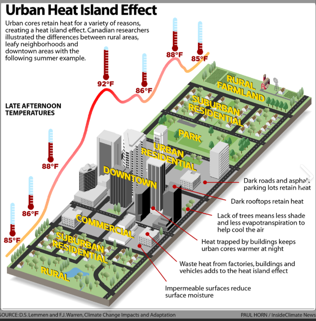
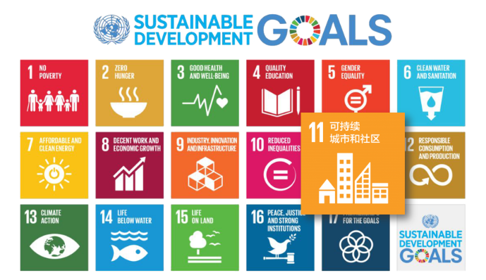
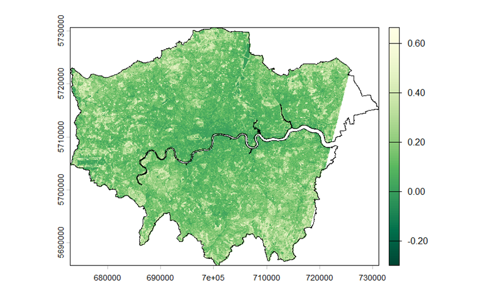
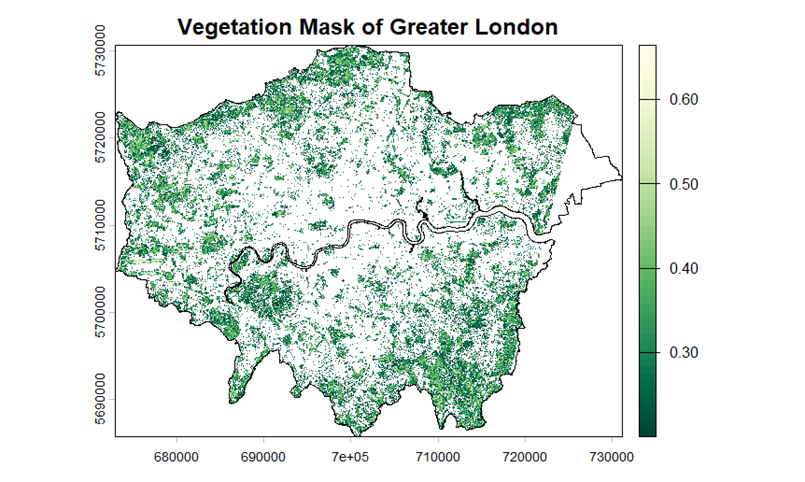

## Summary

This week focused on exploring how remote sensing data can be used to support urban policy. I chose London as my case study city and looked at the issue of the Urban Heat Island effect in relation to the London Plan, particularly its focus on urban greening and climate adaptation.

As urbanisation continues, central London is experiencing higher levels of heat, making it important to consider how increasing green space can help reduce these effects (Figure 1).

{#fig-1 width="85%"}

To support this policy goal, I used the Normalised Difference Vegetation Index (NDVI) as a key indicator derived from remote sensing data. NDVI reflects vegetation coverage and health, making it useful for assessing the distribution of green space in urban areas. It is widely used in urban environmental studies and is also closely linked to Sustainable Development Goal 11 (Sustainable Cities and Communities) (Figure 2).

{#fig-2 width="85%"}

------------------------------------------------------------------------

## Applications

In practice, I used an NDVI map derived from Landsat data (Figure 3) to analyse the spatial distribution of vegetation in London. The results show that NDVI values are generally lower in central urban areas, while higher values are found in the outskirts where vegetation is more abundant. This spatial pattern clearly reflects the relationship between urbanisation and the distribution of green space.

{#fig-3 width="85%"}

Furthermore, by applying an NDVI threshold (NDVI ≥ 0.2), I created a vegetation mask (Figure 4), which makes it easier to distinguish between green and non-green areas across the city. This approach can help policymakers quickly identify areas with limited green space and provide a basis for targeted interventions. For example, areas with lower NDVI values could be prioritised for new green spaces, green roofs, or street vegetation to help reduce local heat stress.

{#fig-4 width="85%"}

Remote sensing data plays an important role in this process. On the one hand, it provides large-scale, continuous, and repeatable data, making it possible to assess environmental conditions at the city level. On the other hand, relatively simple indices and spatial analysis can offer clear and measurable insights to support complex policy decisions. This highlights the potential of remote sensing as a tool for urban governance.

From a broader perspective, this analysis also aligns with global policy frameworks such as the United Nations Sustainable Development Goals (SDG 11), which emphasise improving urban environmental quality and quality of life through increasing green space.

------------------------------------------------------------------------

## Reflection

This week made me realise that remote sensing is not just a technical tool, but also a form of decision support that can directly contribute to policy-making. Compared to previous weeks, which focused more on technical processing, this week required thinking about how to translate data analysis into meaningful policy recommendations, which I found quite challenging.

Through this process, I began to understand that the value of remote sensing does not lie in complex algorithms alone, but in how the results are applied to real-world problems. For example, NDVI itself is a relatively simple index, but when used to identify areas lacking green space, it can directly inform urban planning and environmental management.

In addition, I realised the importance of data interpretation. The same dataset can support different policy directions, and the key is how it is interpreted within a specific urban context. In the case of London, its historical urban structure and land use patterns have led to uneven distribution of green space, and remote sensing data helps to reveal these spatial differences.

------------------------------------------------------------------------

## References

-   **Gerasopoulos, E. et al. (2022)** Earth observation: An integral part of a smart and sustainable city. *Environmental Science & Policy*.
-   **Kadhim, N. et al. (2016)** Advances in remote sensing applications for urban sustainability.
-   **Wellmann, T. et al. (2020)** Remote sensing in urban planning. *Landscape and Urban Planning*.
-   **Martinez, A. & Labib, S. (2023)** NDVI for greenness exposure assessments. *Environmental Research*.
-   **Jensen, J. R. (2015)** *Introductory Digital Image Processing*.

------------------------------------------------------------------------
