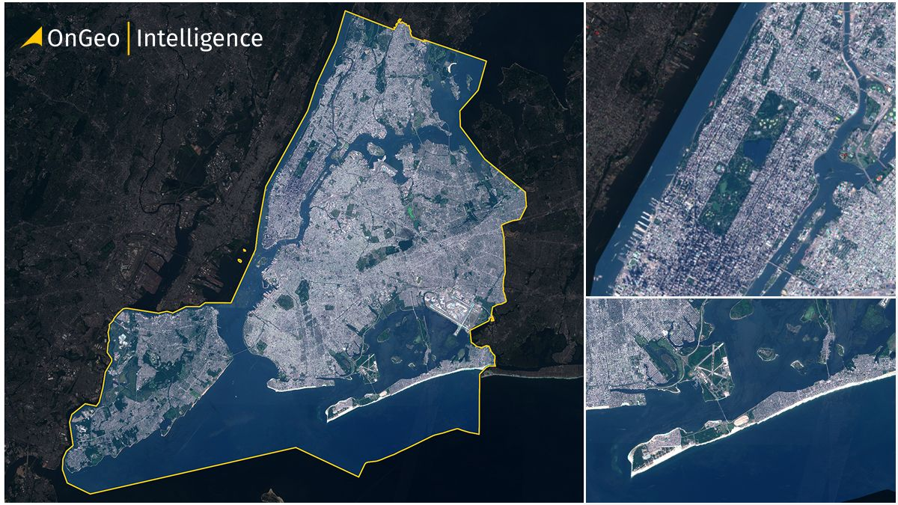
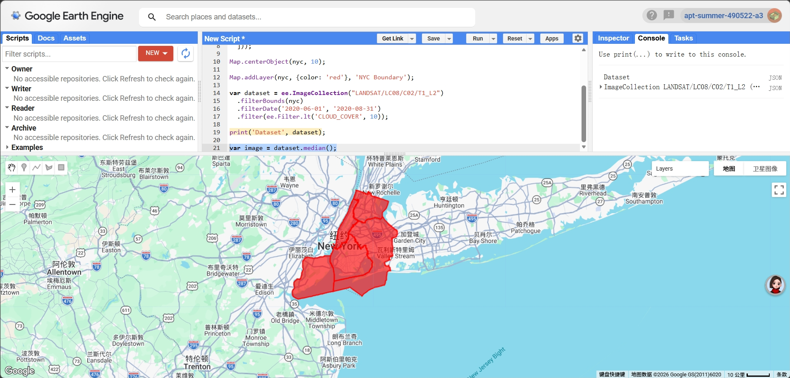
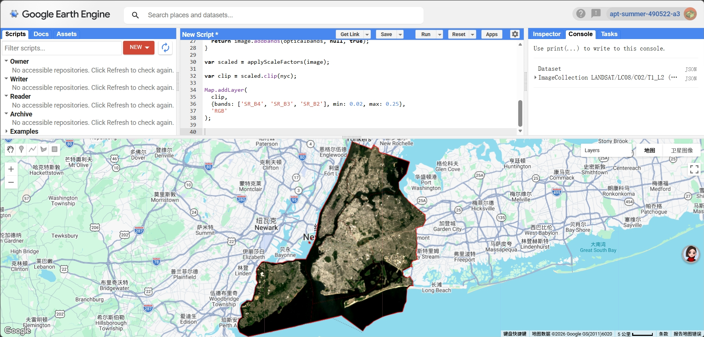
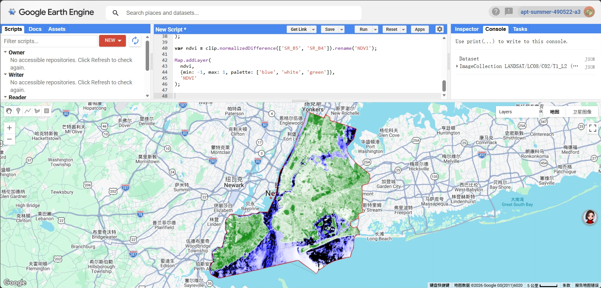
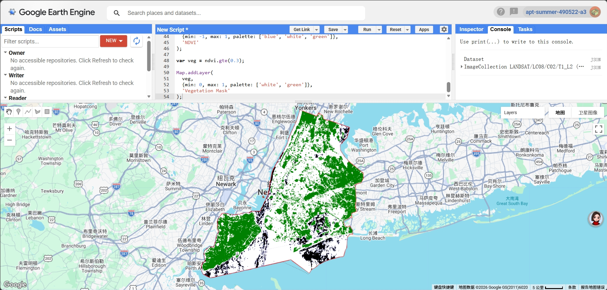
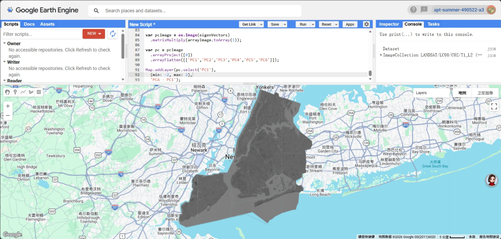

## Summary

This week mainly focused on using Google Earth Engine (GEE) for remote sensing data processing and analysis. Through the practical work, I went through the full workflow, including data filtering, image compositing, and calculating indices and simple classifications. Compared to the previous weeks, which were more theory-based, this week was much more hands-on and focused on actually working with data.

{#fig-1 width="85%"}

In this exercise, I chose New York City as my study area (Figure 1) and focused on urban environmental issues, particularly the distribution of green spaces. The aim was to explore how remote sensing data can be used to support urban planning and environmental management in a more practical way.

------------------------------------------------------------------------

## Applications

In terms of data, I used Landsat 8 Level-2 products and applied temporal filtering (summer 2020) as well as a cloud cover threshold (less than 10%) to obtain relatively clear images. I then created a median composite to combine multiple images into a single representative image, which helped reduce the effects of clouds and noise.

{#fig-2 width="85%"}

During the data processing stage, I first applied scale factors to convert the original digital numbers (DN) into surface reflectance values, which is essential for ensuring reliable analysis. I then used the boundaries of the five boroughs of New York City to clip the imagery (Figure 2), allowing the results to better represent the actual urban extent rather than a simple rectangular area.

{#fig-3 width="85%"}

For visualisation, I first created a true-colour (RGB) image (Figure 3), which makes it easier to see the overall urban structure of New York City, such as dense built-up areas, water bodies, and green spaces.

{#fig-4 width="85%"}

Based on this, I calculated the NDVI (Normalized Difference Vegetation Index) to analyse the distribution of vegetation (Figure 4). The results show that NDVI values are generally lower in central New York City, especially in Manhattan, indicating limited vegetation cover. In contrast, higher NDVI values can be observed in the outer areas of the city and in parks such as Central Park, reflecting healthier and denser vegetation.

{#fig-5 width="85%"}

I then applied a threshold (NDVI ≥ 0.3) to create a vegetation mask (Figure 5), which makes it easier to separate green areas from non-green areas. Most built-up areas appear as non-vegetated, while green spaces are mainly found in parks and around the edges of the city, which matches the actual land use quite well.

{#fig-6 width="85%"}

I also tried applying PCA to the multispectral data to explore dimensionality reduction (Figure 6). Although I was able to generate the first principal component (PC1), the visual result was not very clear, probably due to the complexity of the computation and parameter settings. This made me realise that, compared to NDVI, PCA is less straightforward and requires more careful tuning and higher computational effort.

------------------------------------------------------------------------

## Reflection

Through this week’s learning, I developed a deeper understanding of the full workflow of remote sensing data processing, from data selection and preprocessing to analysis and visualisation. I realised that each step can have a significant impact on the final results. In particular, working with GEE allowed me to experience its efficiency in handling large-scale remote sensing data, while also highlighting the computational limitations of more complex analyses such as PCA in a cloud-based environment.

Compared to previous weeks, I found myself thinking less about how to calculate indices and more about how to use the results in real-world contexts. For example, NDVI and vegetation masks can help identify areas with limited green space, which could be useful for urban planning and addressing urban heat issues.

------------------------------------------------------------------------

## References

-   **Gorelick, N., Hancher, M., Dixon, M., Ilyushchenko, S., Thau, D. and Moore, R. (2017)** Google Earth Engine: Planetary-scale geospatial analysis for everyone. *Remote Sensing of Environment*, 202, pp. 18–27.
-   **Jensen, J.R. (2015)** *Introductory Digital Image Processing: A Remote Sensing Perspective*. 4th edn. Pearson.
-   **Amani, M. et al. (2020)** Google Earth Engine Cloud Computing Platform for Remote Sensing Big Data Applications: A Comprehensive Review. *IEEE Journal of Selected Topics in Applied Earth Observations and Remote Sensing*, 13, pp. 5326–5350.
-   **Martinez, A. de la I. and Labib, S.M. (2023)** Demystifying normalized difference vegetation index (NDVI) for greenness exposure assessments and policy interventions in urban greening. *Environmental Research*, 220, 115155.
-   **United Nations (2015)** Transforming our world: the 2030 Agenda for Sustainable Development. Available at: https://sdgs.un.org/goals (Accessed: 2026).

------------------------------------------------------------------------
