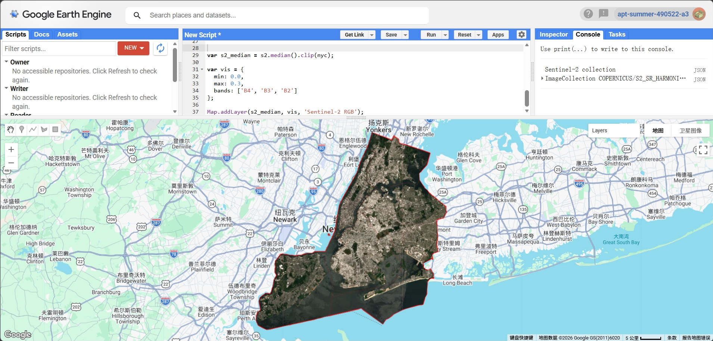
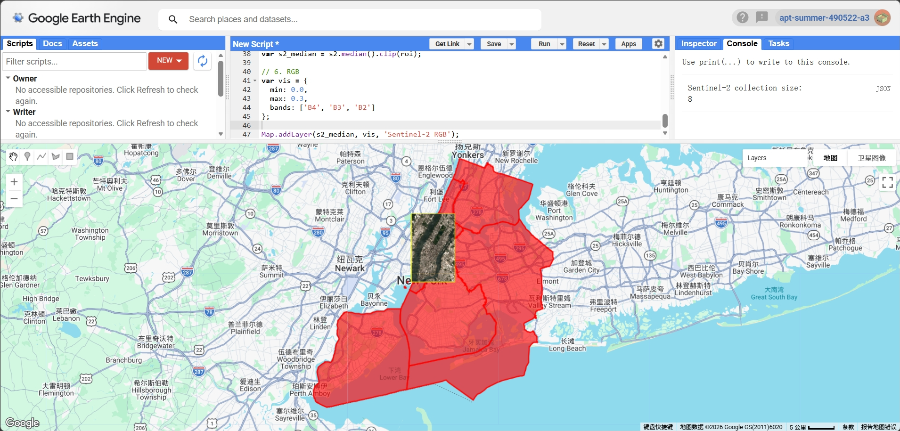
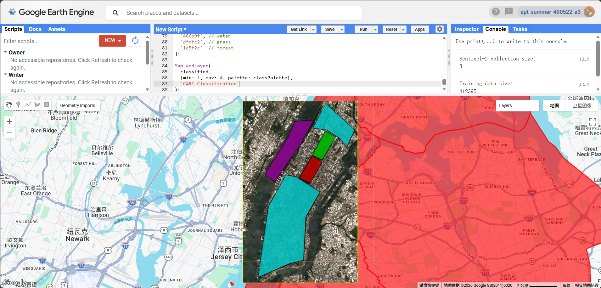
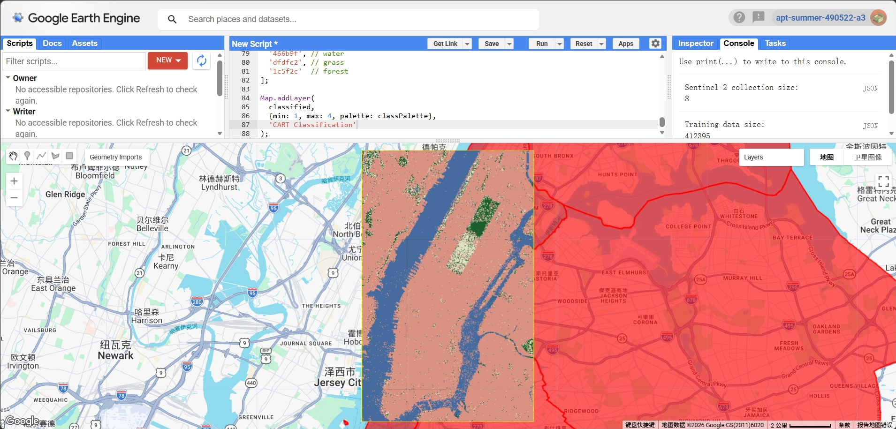

## Summary

This week focused on supervised classification using Google Earth Engine (GEE). Compared to the previous week, which mainly involved indices such as NDVI, this practical introduced a more advanced workflow, including training data selection and applying a classifier to extract thematic information from satellite imagery.

In this exercise, I continued to use New York City as the study area, but instead of analysing vegetation indices, I focused on classifying different land cover types. The aim was to understand how supervised classification works and how training data influences the final results.

---

## Applications

{#fig-1 width=85%}

Similar to last week, I used the New York City boundary as a reference (Figure 1). However, instead of analysing the entire city, I selected a smaller region of interest (ROI) to reduce computational load and avoid processing errors in GEE.

{#fig-2 width=85%}

For this practical, I used Sentinel-2 Surface Reflectance Harmonized data. The imagery was filtered by date (summer 2022) and cloud cover (<10%), and scaled to reflectance values. A median composite was generated to reduce cloud contamination. The RGB image (Figure 2) clearly shows the urban structure, including dense built-up areas, water bodies, and green spaces.

{#fig-3 width=85%}

To perform supervised classification, I manually digitised training polygons for four land cover classes: built-up, water, grass, and forest (Figure 3). These polygons were distributed across the study area and represented relatively pure examples of each class. This step was particularly important, as the quality and distribution of training data directly affect classification performance.

{#fig-4 width=85%}

Using the selected spectral bands (B2, B3, B4, B8, B11, B12), I trained a CART (Classification and Regression Tree) classifier and applied it to the image. The classification result (Figure 4) shows a clear distinction between major land cover types. Water bodies are well identified, especially along the river, while built-up areas dominate most of the urban landscape. Vegetation is separated into grass and forest, although some confusion between these two classes is visible.

---

## Reflection

This week helped me understand the full workflow of supervised classification, from selecting training data to applying a classifier and interpreting results. Compared to NDVI analysis in the previous week, classification is more dependent on user input, particularly the quality of training samples.

One key insight is that even a simple classifier such as CART can produce reasonable results if the training data is well selected. However, I also noticed that classification noise and misclassification can occur, especially between spectrally similar classes such as grass and forest. Additionally, using a smaller ROI significantly improved performance and avoided issues such as the "Computed value is too large" error in GEE.

---

## References

* **Jensen, J.R. (2015)** *Introductory Digital Image Processing: A Remote Sensing Perspective*. 4th edn. Pearson.
* **Gorelick, N., Hancher, M., Dixon, M., Ilyushchenko, S., Thau, D. and Moore, R. (2017)** Google Earth Engine: Planetary-scale geospatial analysis for everyone. *Remote Sensing of Environment*, 202, pp. 18–27.
* **Amani, M. et al. (2020)** Google Earth Engine Cloud Computing Platform for Remote Sensing Big Data Applications: A Comprehensive Review. *IEEE Journal of Selected Topics in Applied Earth Observations and Remote Sensing*, 13, pp. 5326–5350.
* **Pal, M. and Mather, P.M. (2005)** Support vector machines for classification in remote sensing. *International Journal of Remote Sensing*, 26(5), pp. 1007–1011.
* **Google (2023)** Google Earth Engine Data Catalog: Sentinel-2 MSI Surface Reflectance Harmonized. Available at: https://developers.google.com/earth-engine/datasets/catalog/COPERNICUS_S2_SR_HARMONIZED (Accessed: 2026).

------------------------------------------------------------------------
