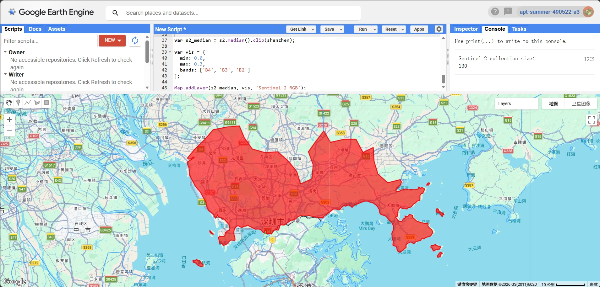
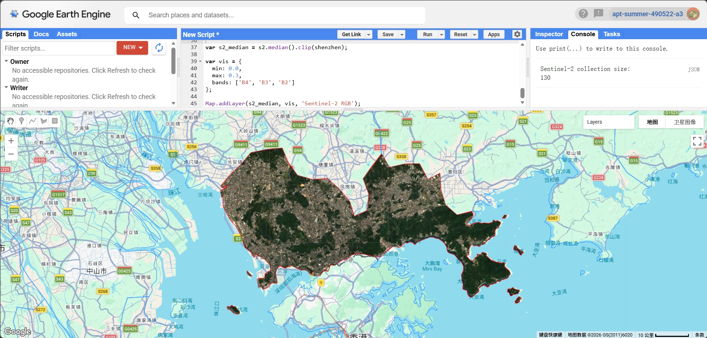
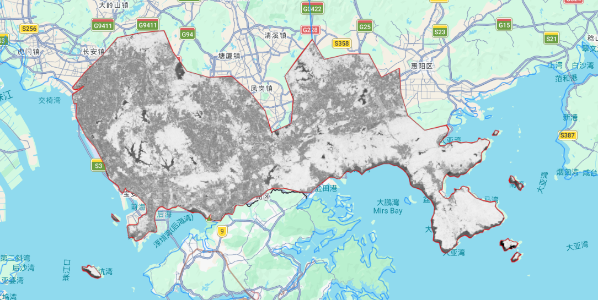
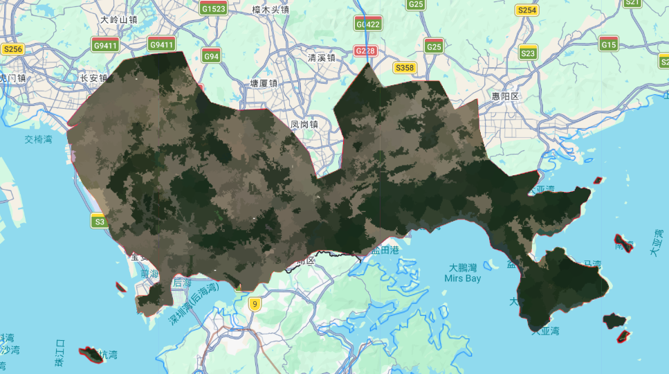
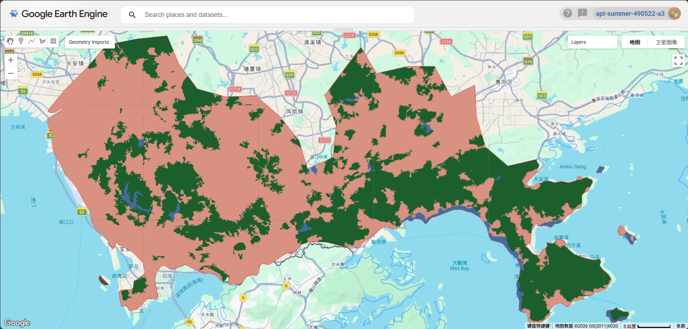

## Summary

This week focused on object-based classification using Google Earth Engine (GEE). Compared to last week’s supervised pixel-based classification, this practical introduced a more advanced approach by grouping pixels into meaningful objects before classification. The aim was to understand how segmentation and object-level features can improve classification results.

In this exercise, I used Shenzhen as the study area instead of New York City. The focus was on applying object-based image analysis (OBIA) using Sentinel-2 imagery and exploring how segmentation parameters influence classification outcomes.

---

## Applications

{#fig-1 width=85%}

Similar to previous weeks, I first defined the study area using the GAUL administrative boundary dataset (Figure 1). The boundary was used to clip all subsequent datasets, ensuring that the analysis was limited to Shenzhen.

{#fig-2 width=85%}

Sentinel-2 Surface Reflectance Harmonized data were used for this analysis. The imagery was filtered by date (2022) and cloud cover (<20%), and scaled to reflectance values. A median composite was generated to reduce cloud contamination. The RGB image (Figure 2) clearly shows the spatial structure of Shenzhen, including urban areas, vegetation, and coastal features.

{#fig-3 width=85%}

To better distinguish vegetation, NDVI was calculated using bands B8 and B4 (Figure 3). The NDVI image highlights areas of dense vegetation, particularly in the eastern and mountainous regions, and provides additional information for classification.

{#fig-4 width=85%}

The SNIC (Simple Non-Iterative Clustering) algorithm was applied to segment the image into superpixels (Figure 4). This step groups pixels into objects based on spectral and spatial similarity, which helps reduce noise and better represent real-world features. Each segment represents a potential classification unit.

{#fig-5 width=85%}

From the SNIC output, object-level features such as mean spectral values and NDVI were extracted (Figure 5). These features were used as inputs for classification, replacing individual pixel values.

{#fig-6 width=85%}

Training polygons were manually created for three classes: built-up, water, and forest. A CART classifier was trained using these samples and applied to the object-based feature image. The final classification (Figure 6) shows that built-up areas dominate most of Shenzhen, while forested areas are concentrated in the eastern regions. Water bodies are identified but appear limited in extent, which reflects the actual distribution in Shenzhen.

---

## Reflection

This week helped me understand the advantages of object-based classification compared to pixel-based methods. By grouping pixels into objects, the classification result appears more spatially coherent and less noisy.

One important observation is that segmentation parameters strongly influence the final result. I tested different seed sizes (e.g., 10 and 20). A smaller seed size (10) was selected for the final output because it captures smaller and fragmented features more effectively. However, this also introduced a more fragmented and slightly noisier classification compared to larger seed sizes.

---

## References

* **Jensen, J.R. (2015)** *Introductory Digital Image Processing: A Remote Sensing Perspective*. 4th edn. Pearson.
* **Gorelick, N., Hancher, M., Dixon, M., Ilyushchenko, S., Thau, D. and Moore, R. (2017)** Google Earth Engine: Planetary-scale geospatial analysis for everyone. *Remote Sensing of Environment*, 202, pp. 18–27.
* **Amani, M. et al. (2020)** Google Earth Engine Cloud Computing Platform for Remote Sensing Big Data Applications: A Comprehensive Review. *IEEE Journal of Selected Topics in Applied Earth Observations and Remote Sensing*, 13, pp. 5326–5350.
* **Google (2023)** Google Earth Engine Data Catalog: Sentinel-2 MSI Surface Reflectance Harmonized. Available at: https://developers.google.com/earth-engine/datasets/catalog/COPERNICUS_S2_SR_HARMONIZED (Accessed: 2026).

------------------------------------------------------------------------
