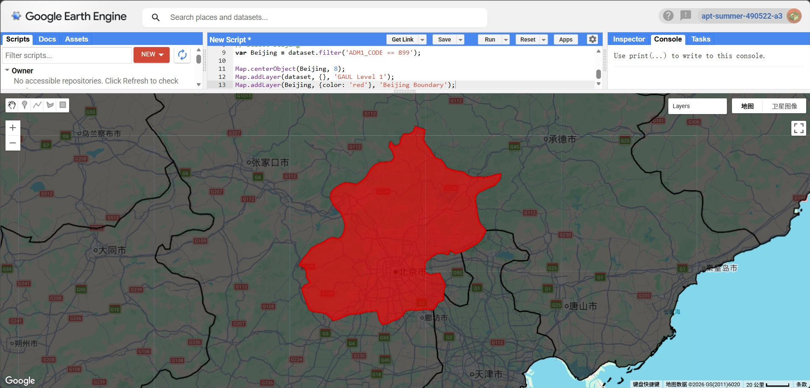
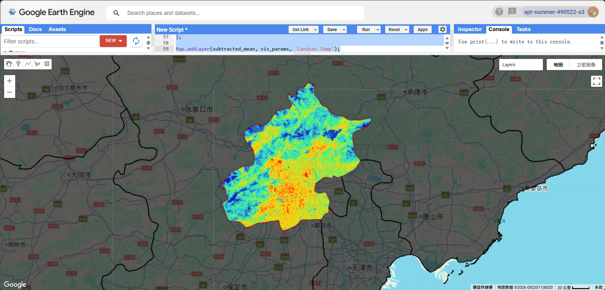
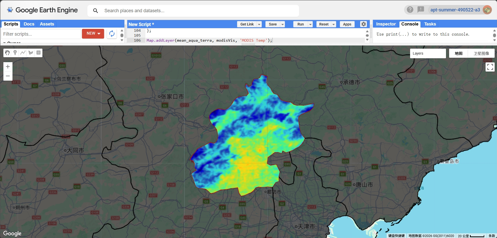
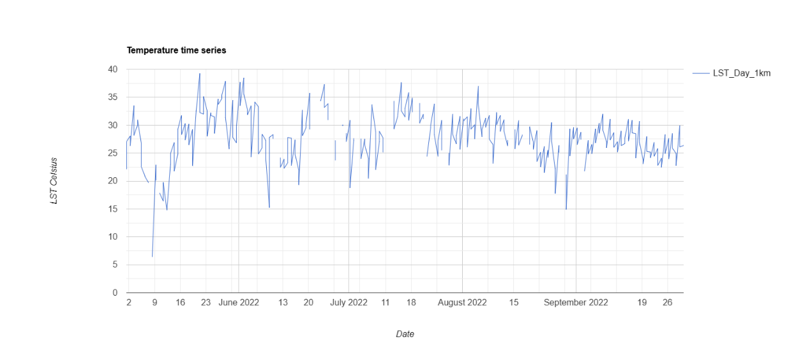
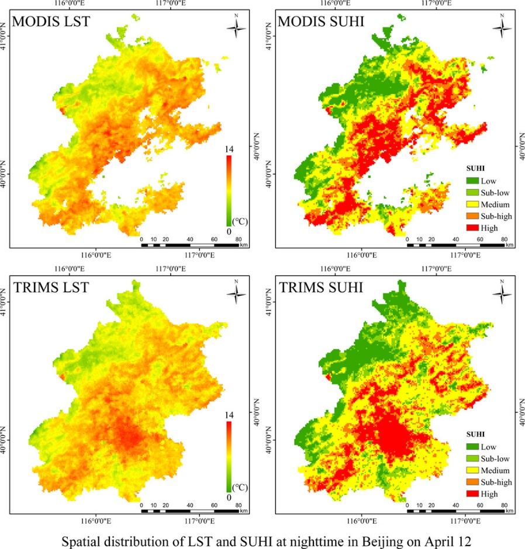

## Summary

This week focused on analysing urban temperature patterns using Google Earth Engine (GEE). Compared to previous weeks, this practical introduced the use of satellite-derived land surface temperature (LST) data and explored both spatial and temporal variations in temperature.

The aim was to understand how temperature differs across urban areas and how different datasets (Landsat and MODIS) can be used for analysis. In this exercise, I used Beijing as the study area and applied both raster-based analysis and spatial aggregation techniques.

---

## Applications

{#fig-1 width=85%}

Similar to previous weeks, I first defined the study area using the GAUL administrative boundary dataset (Figure 1). The boundary was used to clip all subsequent datasets, ensuring that the analysis was limited to Beijing.

{#fig-2 width=85%}

Landsat 8 data were used to calculate land surface temperature during the summer period (May–September). The data were filtered by date and cloud cover, and scale factors were applied to convert the values into Celsius. A mean temperature image was then generated (Figure 2). The result shows clear spatial variation in temperature across Beijing.

{#fig-3 width=85%}

To complement the Landsat data, MODIS data were also used. MODIS provides lower spatial resolution but much higher temporal frequency. After applying scaling factors and merging Terra and Aqua datasets, a mean temperature image was produced (Figure 3). Compared to Landsat, the MODIS result appears smoother due to its coarser resolution.

{#fig-4 width=85%}

A temperature time series was generated using MODIS data (Figure 4). This shows how temperature changes over time during the summer months. The graph indicates fluctuations in temperature, with peaks generally occurring in June and July.

{#fig-5 width=85%}

Since the GAUL level 2 dataset provided very limited subdivisions for Beijing, a grid-based approach was used instead (Figure 5). A regular fishnet grid was created to divide the study area into smaller spatial units for analysis.

{#fig-6 width=85%}

Using the grid, the average temperature for each cell was calculated using the reduceRegions function (Figure 6). This allows temperature to be analysed spatially in a more detailed way. The result shows that central urban areas tend to have higher temperatures, while outer regions are relatively cooler.

---

## Reflection

This week helped me understand the differences between Landsat and MODIS datasets. Landsat provides higher spatial resolution, which is useful for identifying detailed spatial patterns such as urban heat islands. In contrast, MODIS provides higher temporal resolution, making it suitable for analysing changes over time.

One challenge I encountered was working with spatial units. Initially, I attempted to use administrative boundaries, but the GAUL level 2 dataset did not provide sufficient detail for Beijing. As a result, I switched to a grid-based approach, which proved to be a more flexible and effective solution.

{#fig-7 width=85%}

To further evaluate my results, I compared them with a published study showing both LST and SUHI patterns in Beijing (Figure 7). The reference figure indicates that higher temperatures and stronger urban heat island effects are mainly concentrated in the central urban areas, while peripheral regions remain cooler. This pattern is consistent with my own results derived from both Landsat and MODIS datasets, where central Beijing shows relatively higher temperatures.

However, the reference study includes additional analysis such as SUHI classification and uses different datasets (e.g. TRIMS), which were not implemented in my workflow. This suggests that more advanced methods could provide a deeper understanding of urban heat dynamics and could be explored in future work.

---

## References

* **Gorelick, N., Hancher, M., Dixon, M., Ilyushchenko, S., Thau, D. and Moore, R. (2017)** Google Earth Engine: Planetary-scale geospatial analysis for everyone. *Remote Sensing of Environment*, 202, pp. 18–27.
* **Amani, M. et al. (2020)** Google Earth Engine Cloud Computing Platform for Remote Sensing Big Data Applications: A Comprehensive Review. *IEEE Journal of Selected Topics in Applied Earth Observations and Remote Sensing*, 13, pp. 5326–5350.
* **Google (2023)** Google Earth Engine Data Catalog: Landsat and MODIS datasets. Available at: https://developers.google.com/earth-engine (Accessed: 2026).
* **Liao, Y. et al. (2023)** Surface urban heat island detected by all-weather satellite land surface temperature. *Remote Sensing of Environment*.

------------------------------------------------------------------------

