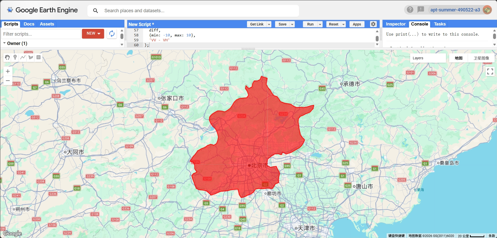
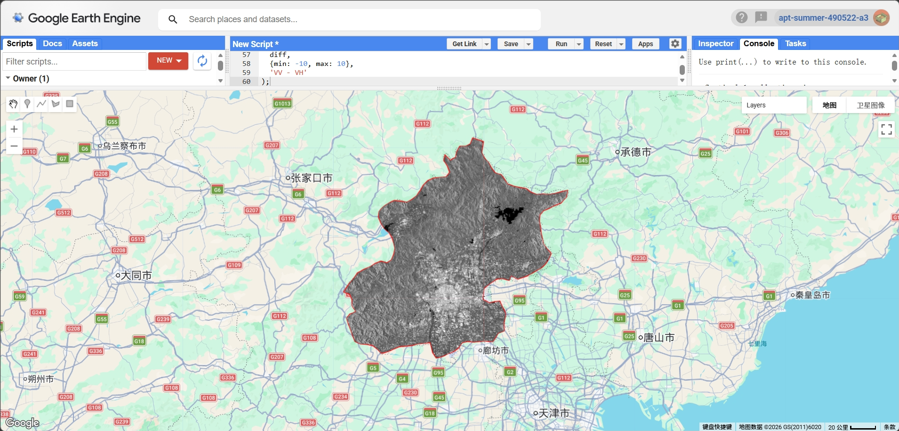
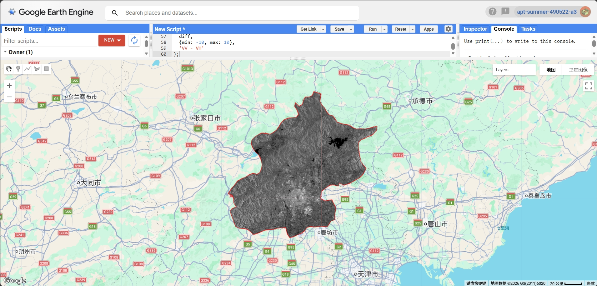
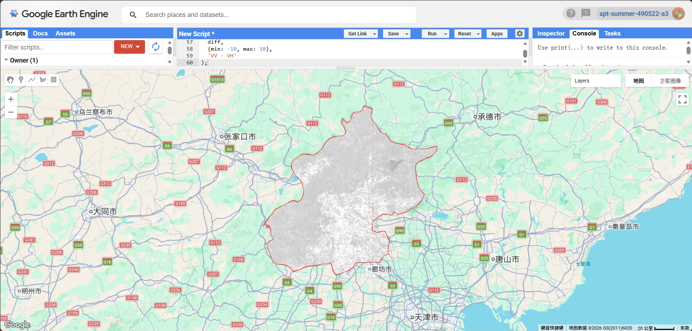

## Summary

This week focused on the use of Synthetic Aperture Radar (SAR) data for analysing land surface characteristics. Unlike optical satellite imagery, SAR uses microwave signals and is not affected by cloud cover or atmospheric conditions, making it particularly useful for consistent Earth observation.

The aim of this practical was to explore how SAR data can be used to distinguish different land surface types. Sentinel-1 data were used to analyse Beijing, with particular attention given to different polarisation bands (VV and VH). The analysis also explored the differences between these bands and how they represent urban, water, and vegetated surfaces.

---

## Applications

{#fig-1 width=85%}

The study area was defined using the GAUL administrative boundary dataset. This boundary was used to clip all SAR data to ensure that the analysis focused only on Beijing.

{#fig-2 width=85%}

Sentinel-1 SAR data were used to analyse surface characteristics. The VV polarisation image (Figure 2) shows strong backscatter in urban areas, which appear brighter due to the presence of buildings and infrastructure. In contrast, water bodies appear very dark due to low backscatter, while vegetated areas show intermediate values.

{#fig-3 width=85%}

The VH polarisation image (Figure 3) provides additional information about surface properties. Compared to VV, the VH image appears smoother and is more sensitive to vegetation structure. This makes it useful for distinguishing vegetated areas from built-up regions.

{#fig-4 width=85%}

The difference between VV and VH polarisations was also calculated (Figure 4). However, the contrast is less distinct compared to the individual VV and VH images. This suggests that, in this case, the individual polarisation bands provide clearer information for interpreting land surface characteristics.

---

## Reflection

This week introduced the use of Synthetic Aperture Radar (SAR) data, which differs significantly from optical satellite imagery. One key advantage of SAR is that it is not affected by cloud cover, making it particularly useful for consistent monitoring.

Through this practical, I learned that different polarisation bands provide different types of information. The VV polarisation was most effective for identifying urban areas, as built-up surfaces produced strong backscatter signals. In contrast, VH was more sensitive to vegetation, allowing for better differentiation of natural surfaces.

Comparing VV and VH also highlighted how SAR can be used to interpret surface structure rather than spectral properties. Although the VV–VH difference was explored, it provided less clear contrast in this case, indicating that simpler visualisation methods may sometimes be more effective.

---

## References

* **Schulte to Bühne, H. and Pettorelli, N. (2018)** Better together: Integrating and fusing multispectral and radar satellite imagery to inform biodiversity monitoring, ecological research and conservation science. *Methods in Ecology and Evolution*, 9, pp. 849–865.
* **Lu, D., Li, G., Moran, E., Dutra, L. and Batistella, M. (2011)** A comparison of multisensor integration methods for land cover classification in the Brazilian Amazon. *GIScience & Remote Sensing*, 48(3), pp. 345–370.
* **Dabboor, M. and Brisco, B. (2018)** Wetland monitoring and mapping using Synthetic Aperture Radar. In: *Wetlands Management – Assessing Risk and Sustainable Solutions*. IntechOpen.
* **Google (2023)** Google Earth Engine Data Catalog: Sentinel-1 SAR data. Available at: https://developers.google.com/earth-engine (Accessed: 2026).

------------------------------------------------------------------------

